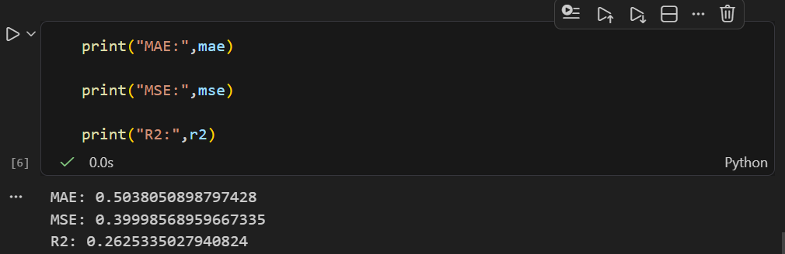

# ⚽ Football Player Rating Prediction using Machine Learning

## 📌 Project Overview

This project is an end-to-end Machine Learning regression project that predicts a football player's match rating using various in-game performance statistics collected during football matches.

The project follows the complete Machine Learning workflow, beginning from business understanding and data exploration to data cleaning, feature selection, model training, and evaluation. It was developed as part of an AI/ML learning assignment to demonstrate practical implementation of the concepts covered during training.

---

# 🎯 Problem Statement

Football clubs, coaches, scouts, and sports analysts evaluate player performances after every match to make decisions regarding team selection, player development, transfers, and tactical planning.

The objective of this project is to build a Machine Learning model capable of predicting a player's match rating based on their match performance statistics.

---

# ❓Business Question

**Can we accurately predict a football player's overall match rating using their in-game performance statistics?**

---

# 📊 Problem Type

**Regression**

The target variable (`player_rating`) is a continuous numerical value, making this a supervised regression problem.

---

# 📂 Dataset Information

* **Source:** Kaggle
* **Domain:** Football Analytics
* **Original Dataset**

  * 54,600 rows
  * 75 columns

After preprocessing:

* 31,156 rows
* 59 columns

The dataset contains player information, match statistics, physical attributes, passing statistics, defensive statistics, attacking statistics, and overall performance metrics.

---

# 🎯 Target Variable

```text
player_rating
```

The goal of the model is to predict a player's match rating.

---

# 🛠 Project Workflow

### 1. Business Understanding

* Defined the prediction problem
* Identified stakeholders
* Selected target variable
* Determined problem type

---

### 2. Data Understanding

Performed initial data exploration by examining:

* Dataset dimensions
* Column names
* Data types
* Summary statistics
* Missing values
* Unique values
* Target variable distribution

---

### 3. Data Cleaning

The following preprocessing steps were performed:

* Removed players with zero match ratings
* Removed players with zero minutes played
* Removed unnecessary columns
* Checked missing values
* Verified duplicate records
* Prepared a clean dataset for modeling

---

### 4. Exploratory Data Analysis (EDA)

EDA was performed to understand the dataset through visualizations and statistical summaries.

Examples include:

* Target variable distribution
* Correlation analysis
* Feature relationships
* Data distribution
* Outlier inspection

---

### 5. Feature Selection

Several features that were either identifiers, location-based information, or derived performance metrics were removed to improve model quality and reduce the risk of data leakage.

Examples of removed features include:

* jersey_number
* stadium
* city
* match_date
* club_name
* performance_score
* offensive_contribution
* defensive_contribution
* creativity_score
* consistency_score
* clutch_performance_score
* tournament_rating

---

### 6. Feature Encoding

Categorical variables were converted into numerical format using one-hot encoding (`pd.get_dummies`) to make them suitable for machine learning.

---

### 7. Train-Test Split

The cleaned dataset was divided into:

* Training Set: 80%
* Testing Set: 20%

The testing dataset remained unseen during training to provide an unbiased evaluation of model performance.

---

### 8. Model Selection

The project uses:

## Random Forest Regressor

### Why Random Forest?

Random Forest Regressor was selected because:

* The task is a regression problem.
* Football player performance depends on complex and nonlinear relationships between multiple match statistics.
* Random Forest can capture these nonlinear patterns effectively.
* It reduces overfitting by combining predictions from multiple decision trees.
* It performs well on datasets containing many input features.

---

### Model Training

The model was trained using the cleaned training dataset after preprocessing and feature encoding.

---

### Model Evaluation

The model was evaluated using unseen testing data.

Evaluation Metrics:

| Metric                    | Value      |
| ------------------------- | ---------- |
| Mean Absolute Error (MAE) | **0.5038** |
| Mean Squared Error (MSE)  | **0.4000** |
| R² Score                  | **0.2625** |

---

# 📈 Results

The model successfully learned meaningful relationships between player performance statistics and overall player ratings.

Although the R² score indicates there is room for improvement, the project successfully demonstrates a complete and reliable end-to-end Machine Learning workflow using clean and non-leaking features.



---

# 📁 Project Structure

```text
Football-Player-Rating-Prediction
│
├── data
│   ├── football_dataset.csv
│   └── football_dataset_cleaned.csv
│
├── notebooks
│    
├── README.md
├── requirements.txt
└── .gitignore
```

---

# 💻 Technologies Used

* Python
* Pandas
* NumPy
* Matplotlib
* Seaborn
* Scikit-learn
* Jupyter Notebook
* Git
* GitHub
----

# 📚 What I Learned

During this project I gained practical experience with:

* Business understanding
* Data exploration
* Data cleaning
* Exploratory Data Analysis (EDA)
* Feature selection
* Feature encoding
* Train-test splitting
* Machine Learning model training
* Model evaluation
* Git and GitHub workflow
* Building an end-to-end Machine Learning pipeline

---

# ⚠ Challenges Faced

Some challenges encountered during this project included:

* Selecting a high-quality football dataset that was suitable for a regression problem.
* Choosing between Linear Regression and Random Forest Regressor, and justifying the final model selection based on the dataset and problem type.
* Understanding and interpreting evaluation metrics, especially the meaning of the R² score.
* Improving model performance by tuning the Random Forest model after the initial results were not satisfactory. Still Room for improvement
* Interpreting evaluation metrics and understanding the model's performance.
* Facing a GitHub Pull Request issue caused by a GitHub server-side error, which delayed merging for around 30 minutes. The issue was eventually resolved after troubleshooting and contacting GitHub Support.

---

# 🔮 Future Improvements

Possible improvements include:

* Hyperparameter tuning using GridSearchCV or RandomizedSearchCV.
* Additional feature engineering.
* Cross-validation.
* Testing advanced ensemble methods such as XGBoost or LightGBM.
* Deploying the trained model as a web application.

---

# 📝 Daily Progress

### What this repository contains

A complete end-to-end Machine Learning project for predicting football player ratings using match statistics.

### What was completed

* Dataset selection
* Business understanding
* Data understanding
* Data cleaning
* Exploratory Data Analysis
* Feature selection
* Feature encoding
* Model training
* Model evaluation
* Git and GitHub version control

### Choosing the most relevant predictive features.

---

# 👨‍💻 Author

**Muhammad Hadin Mirza**

Computer Engineering Student

Machine Learning Enthusiast

This project was developed for learning purposes and to demonstrate an end-to-end Machine Learning workflow suitable for an academic portfolio.
